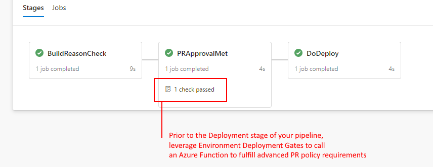

# Azure DevOps Pull Request Policy Checking

When you run pipelines in Azure DevOps as part of a build policy, the pipeline will not wait for other Pull Request policies to be satisfied first. It'll just be run, and depends on the PR feedback you're yet to get - you might not want it to work that way.

## The Process

You'll need to use an Environment as part of your pipeline.  On the Environment, we'll add an Approval that will run some code to verify the other Pull Request policies have been approved/met.

*Components*
1. A Sample `pipeline` file is provided in this directory, it'll create the Environment stubs for you in Azure DevOps. If you're using your own existing pipeline file, make sure to declare an `Environment`
1. A deployed `Azure Function` (of type PowerShell), which uses the PowerShell script in this folder. You won't need to change this code, as the variable components will be defined in your Environment Approval Gate.
1. An `Environment approval gate`, defined to call the Azure Function.  A sample configuration image is provided in this folder.

## Security

The Azure Function will either use an ADO security access token which is passed to it by the ADO Approval gate, or from the Azure Function Application Settings, depending on your preferences.